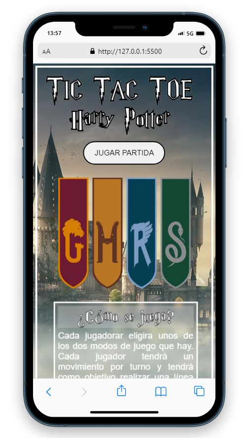
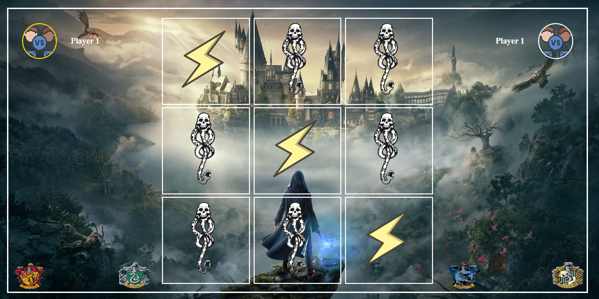
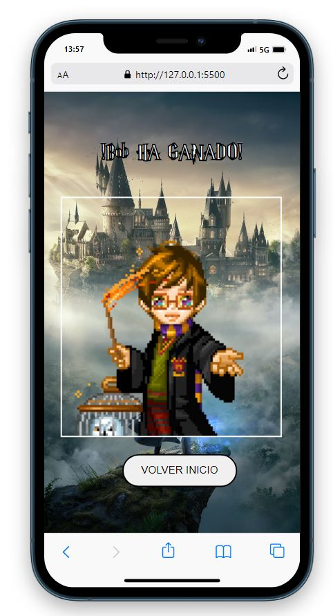

  

<h1 align="center">Tic Tac Toe Harry Potter</h1>

---

## 📝 Tabla de Contenidos

- [Introducción](#Introducción)
- [Pre-requisitos](#Pre-requisitos)
- [Construido con](#Construido)
- [Uso](#uso)
- [Demo](#Demo)
- [Capturas de Pantalla](#CapturasdePantalla)
- [Contacto](#Contacto)

## Introducción 🧐 

Tercer proyecto del Bootcamp FullStack Developer de Geekshub Academy. Para esta entrega se nos pedía realizar un Tic Tac Toe (Tres en Raya) dónde nosotros elegimos si jugar contra la máquina o contra un amigo nuestro.

## Pre-requisitos 📋 

    · Editor de Texto -> Visual Studio Code
    · Descargarse la extensión de Live Server para Visual Studio Code

## Construido con 🛠️ 

Este proyecto ha sido creando utilizando los siguientes lenguajes;

    · HTML
    · CSS
    · JavaScript

## Uso 🛠️

    Cuando entremos por primera vez a la web nos saldrá una breve explicación de los dos modos de juego que hay que son, Jugador VS Jugador y Jugador VS CPU. También podremos encontrar una breve explicación de como se juega. Al darle clic al botón de jugar se nos abrirá un Modal Box en el cual podremos configurar nuestra partida y al terminar nos saldrá el tablero de juego. Los movimientos de la CPU son aleatorios, pero intentará ir a ganar.

## Demo 👀 

Para visualizar la demo <a href="https://raulscz10.github.io/tic-tac-toe/" target="_blank"> clic aqui </a>.
## Capturas de Pantalla  📸 

A continuación os dejo una preview de como ha quedado el proyecto.

Primera Página:

Segunda Página (tablero).

Tercera Página (resultado).

## Contacto 📧 

En caso de que tengáis alguno o queráis hacer algún aporte al código, podéis escribirme a mi correo.

    · raulscz10@gmail.com